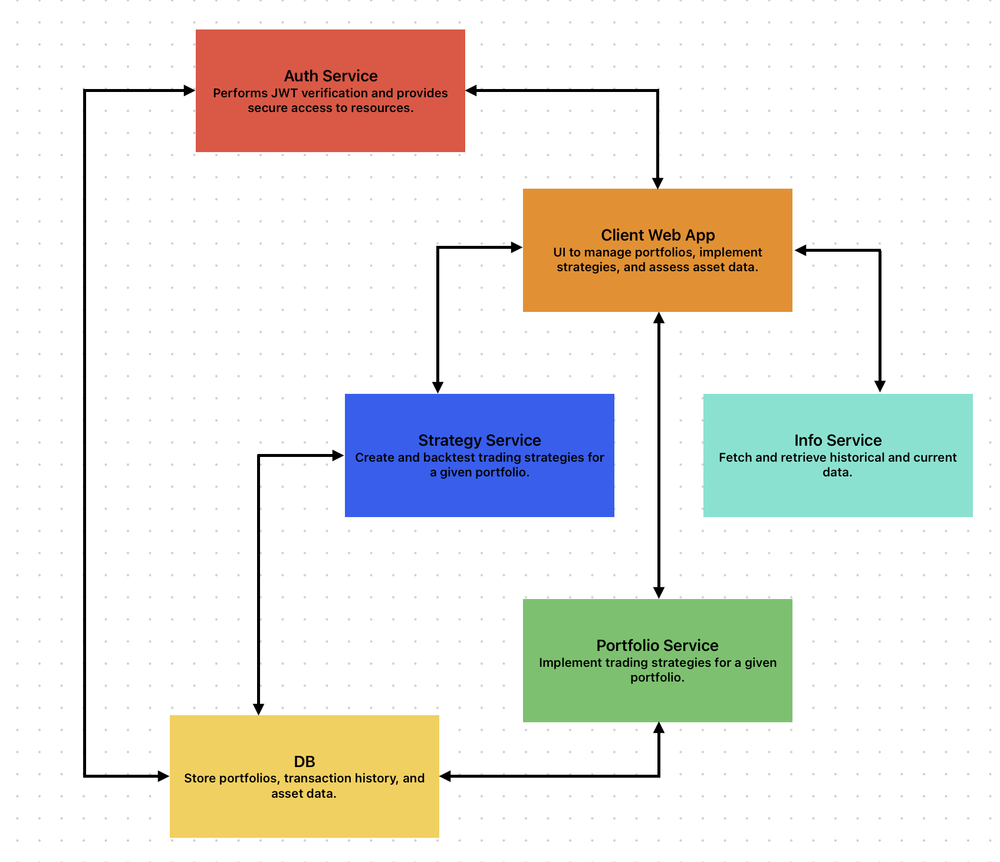

# Sahil Memon 👋

Software Engineer with 3 years of experience in **full-stack software development** focusing on **frontend web/mobile** and **backend microservices architecture**. 

## Stack 💻 ☕️

- **Java**
- **TypeScript**
- **JavaScript**
- **Spring Boot**
- **Node.js**
- **React**
- **React Native**
- **SQL**
- **NoSQL**
- **CI/CD**
- **TDD**
- **AWS**
- **GCP**

Skilled in designing and implementing **secure**, **scalable**, and **reliable full-stack systems**. Passionate about **enterprise software development** and delivering **performant technical solutions**. 🌍 📊 📈

## Notable Projects 🚀

### ATS

Currently developing an algorithmic trading system.

- [**Crypto Info Service**](https://github.com/sahilm8/crypto_info_svc)
- [**Stock Info Service**](https://github.com/sahilm8/stock_info_svc)
- [**Stock Portfolio Service**](https://github.com/sahilm8/stock_portfolio_svc)

### Misc
- [**Microservice Template**](https://github.com/sahilm8/microservice_template)

## Links 📫

- [**LinkedIn**](https://www.linkedin.com/in/sahil-memon-917242321/)
- [**LeetCode**](https://leetcode.com/u/sahilm8/)
- [**HackerRank**](https://www.hackerrank.com/profile/sahilm8)
